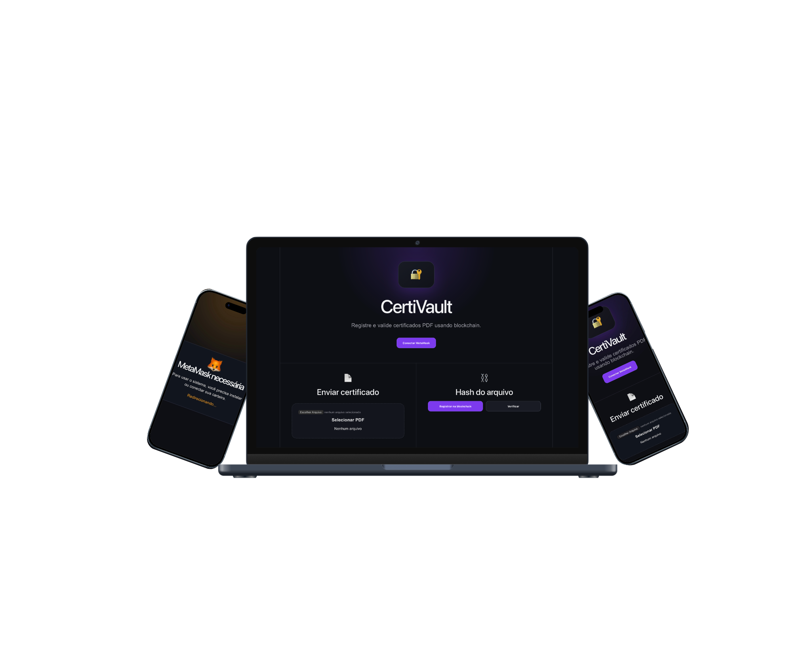

# 🔐 CertiVault

CertiVault é uma aplicação Web3 para registrar e validar certificados PDF usando blockchain.

---

<p align="center">
  <a href="https://jadeprog.github.io/certichain/" target="_blank">
    
  </a>
</p>

<p align="center">
  <a href="https://jadeprog.github.io/certichain/" target="_blank">
    
  </a>
</p>

---

## 🗒️ Sobre o projeto

O objetivo do CertiVault é permitir que um certificado seja enviado, transformado em um hash único e registrado na blockchain. Depois, esse mesmo arquivo pode ser validado para verificar se ele corresponde ao registro original.

---

Para evitar problemas de conexão com a MetaMask, siga estas instruções:

1. Abra a extensão da MetaMask no navegador **Chrome** de preferência
- Vá em permissões da extensão
- Ative: **Allow on all sites**
  
2. Faça login na sua carteira
3. Certifique-se de que a rede selecionada é: 🌐 **Sepolia Test Network**

4. Deixe a MetaMask aberta/ativa antes de acessar o sistema

## 🧭 Fluxo do usuário

<p align="center">
  
</p>

## ✨ Funcionalidades

- Conexão com MetaMask
- Upload de certificado em PDF
- Geração de hash do arquivo
- Registro do hash na blockchain
- Verificação de autenticidade do certificado
- Interface responsiva com React

---

## 🛠️ Tecnologias utilizadas

- React  
- Vite  
- JavaScript  
- CSS  
- MetaMask  
- Blockchain  
- GitHub Pages  

---

## 📦 Como rodar localmente

```bash
git clone https://github.com/JadeProg/certichain.git  
cd certichain  
npm install  
npm run dev  

---

📤 Deploy

npm run build  
npm run deploy  

---
```
## 👩🏻‍🦰 Desenvolvedora

*   **Jade Pereira da Paz**
*   [LinkedIn](https://www.linkedin.com/in/jade-paz/)
*   [GitHub](https://github.com/JadeProg)

